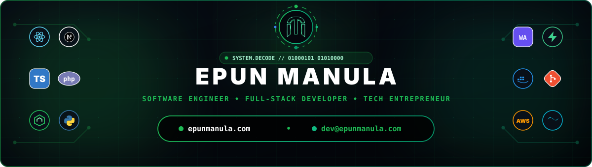

  

 

  
  
  

---

### 👨‍💻 About Me & Engineering Philosophy

Welcome to my digital workspace! I'm **Epun Manula**, a Computer Science Undergraduate, Full-Stack Software Engineer, and Tech Entrepreneur from Sri Lanka. I specialize in building high-performance web systems, cloud architectures, browser automation extensions, desktop applications, and client-side WebAssembly AI utilities.

- 🌐 **Official Website & Portfolio:** **[epunmanula.com](https://epunmanula.com)**
- 🔗 **Bio & Social Links Hub:** **[epunmanula.com/bio](https://epunmanula.com/bio)**
- ✉️ **Direct Email:** **[dev@epunmanula.com](mailto:dev@epunmanula.com)**
- 🎓 **Education & Focus:** Computer Science undergraduate specializing in full-stack architecture, clean backend APIs, browser extensions, and human-centered UI design.
- 🎵 **Creative Work:** Independent Music Producer & Sound Designer streaming across Apple Music & SoundCloud.
- ⚡ **Engineering Mindset:** Passionate about bridging complex backend logic with smooth micro-animations, client-side AI, and custom audio DSP algorithms!

---

### 🚀 Featured Engineering Solutions & Projects

 

#### 🎮 Full-Stack & Cloud Platforms

| Project | Description | Tech Stack | Quick Links |
| :--- | :--- | :--- | :---: |
| **Havoc Gaming Platform** | Real-time esports gaming ecosystem with live match tracking, tournament feeds, and dark neon glassmorphism UI. | `Next.js` `TypeScript` `Supabase` `Tailwind CSS` | [🌐 Live Demo](https://havocgaming.gt.tc/) • [📦 GitHub](https://github.com/epunmanula/Havoc-Gaming-Website) |
| **UMSL Tickets Platform** | Full-stack online event ticketing platform with real-time seat reservation, admin portal, and mobile-first checkout. | `PHP` `MySQL` `JavaScript` `Bootstrap` | [🌐 Case Study](https://epunmanula.com/projects) • [📦 GitHub](https://github.com/epunmanula) |
| **Oxy Fitness Gym Platform** | Modern fitness club web portal with secure member authentication, class scheduling, and interactive user dashboard. | `PHP` `MySQL` `JavaScript` `CSS3` | [🌐 Live Demo](https://oxyfitness.gt.tc/) • [📦 GitHub](https://github.com/epunmanula/oxy-fitness-gym-web) |
| **TechSet Solutions** | Full corporate tech solutions web application with responsive dark aesthetics, automated contact workflow, and SEO. | `PHP` `MySQL` `HTML5` `CSS3` | [🌐 Case Study](https://epunmanula.com/projects) • [📦 GitHub](https://github.com/epunmanula) |

 

#### 🧩 Browser Extensions & Web Tools

| Project | Description | Tech Stack | Quick Links |
| :--- | :--- | :--- | :---: |
| **EMME Audio EQ Extension** | High-fidelity 10-Band Chrome audio equalizer & 3D spatial enhancer using Manifest V3 Offscreen DSP across YouTube & web streaming. | `Manifest V3` `Web Audio API` `JavaScript` | [🛒 Chrome Web Store](https://chromewebstore.google.com/detail/ohheeckckfhnhhhhekapdnlcebkbdnbd) • [📦 GitHub](https://github.com/epunmanula) |
| **EMME Tabs** | Cyber-glassmorphism Chrome new-tab dashboard with custom canvas audio visualizers, quick bookmarks, and productivity widgets. | `Chrome API` `HTML5 Canvas` `CSS3` | [🌐 Live Demo](https://emmetabs.fwh.is/) • [📦 GitHub](https://github.com/epunmanula) |
| **Video Speed Master** | Precision HTML5 video playback speed controller extension with granular speed stepping and global hotkey shortcuts. | `HTML5 Video API` `JavaScript` `CSS3` | [🌐 Live Demo](https://emmevideospeedmaster.page.gd/) • [📦 GitHub](https://github.com/epunmanula) |
| **EmmE QR Scanner** | Fast, modern QR code scanner and generator extension for Chrome and Edge with zero-latency camera decoding. | `Chrome API` `JavaScript` `Canvas` | [📦 GitHub](https://github.com/epunmanula) |

 

#### ⚡ Desktop, AI & Productivity Applications

| Project | Description | Tech Stack | Quick Links |
| :--- | :--- | :--- | :---: |
| **EmmE Browser** | Production-quality Windows-first Chromium desktop browser engineered for performance, lightweight memory, and user privacy. | `Chromium` `Node.js` `Electron` `C++` | [📦 GitHub](https://github.com/epunmanula) |
| **PrivacyBlur AI** | Privacy-first browser utility that detects and blurs faces locally in real time using client-side WebAssembly BlazeFace AI. | `Wasm` `BlazeFace AI` `JavaScript` | [🌐 Live Demo](https://privacyblur.42web.io/) • [📦 GitHub](https://github.com/epunmanula) |
| **MHabit Tracker** | Unified habit formation & focus ecosystem operating smoothly across Web, Desktop (Electron), and Android WebView. | `Electron` `JavaScript` `Android WebView` | [🌐 Live Demo](https://mhabitracker.xo.je) • [📦 GitHub](https://github.com/epunmanula) |
| **EM.Focus Productivity** | Minimalist distraction-free Pomodoro deep-work timer with ambient soundscapes and session progress analytics. | `PHP` `JavaScript` `Web Audio` | [🌐 Live Demo](https://emmefocus.gt.tc/?i=1) • [📦 GitHub](https://github.com/epunmanula/emmefocus) |
| **NIBM DSE Academic Hub** | Comprehensive academic portal and Android companion app providing lecture tools, schedule sync, and software engineering utilities. | `React` `Android` `REST API` | [📦 GitHub](https://github.com/epunmanula) |

---

### 🟢 ⬛ ⚪ GitHub Signature Analytics (Custom Emerald • Dark Canvas)

  

 

  

 

  
  
  

---

### 🛠️ Tech Stack & Engineering Toolkit

 

<table align="center" border="0" cellpadding="15" cellspacing="0" width="100%">
  <tr>
    <td align="center" valign="top" width="50%">
      <h4>💻 Frontend & Web Systems</h4>
      
      
      
      
      
      
      
      
    </td>
    <td align="center" valign="top" width="50%">
      <h4>⚙️ Backend & Architecture</h4>
      
      
      
      
      
      
    </td>
  </tr>
  <tr>
    <td align="center" valign="top" width="50%">
      <h4>🗄️ Databases, Cloud & DevOps</h4>
      
      
      
      
      
      
      
    </td>
    <td align="center" valign="top" width="50%">
      <h4>🎨 Creative Tools & Engineering Workspace</h4>
      
      
      
      
      
      
    </td>
  </tr>
</table>

---

### 🐍 GitHub Contribution Matrix

  

---

### 📫 Connect & Collaborate

  

 

  
  
  
  
  
  
  

 
