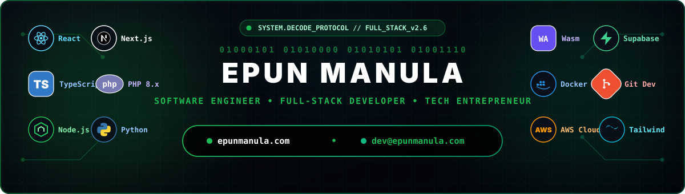

  

 

  

  

  
  
  

---

### 👨‍💻 About Me & Engineering Philosophy

Welcome to my digital workspace! I'm **Epun Manula**, a Computer Science Undergraduate, Full-Stack Software Engineer, and Tech Entrepreneur from Sri Lanka. I specialize in building high-performance web systems, cloud architectures, browser automation extensions, and client-side WebAssembly AI utilities.

- 🌐 **Official Website & Portfolio:** **[epunmanula.com](https://epunmanula.com)**
- 🔗 **Bio & Social Links Hub:** **[epunmanula.com/bio](https://epunmanula.com/bio)**
- ✉️ **Direct Email:** **[dev@epunmanula.com](mailto:dev@epunmanula.com)**
- 🎓 **Education & Focus:** Computer Science undergraduate specializing in full-stack architecture, clean backend APIs, and human-centered UI design.
- 🔭 **Currently Building & Scaling:**
  - 🎮 [**Havoc Gaming Platform**](https://epunmanula.com/projects) — Next.js, TypeScript, & Supabase real-time esports ecosystem.
  - 🧩 [**EMME Tabs**](https://epunmanula.com/projects) — Premium glassmorphism Chrome new-tab dashboard with custom canvas visualizers.
  - 🛡️ [**PrivacyBlur AI**](https://epunmanula.com/projects) — Privacy-first browser tool blurring faces locally via WebAssembly BlazeFace AI.
  - 📊 [**MHabit Tracker**](https://epunmanula.com/projects) — Unified habit & focus ecosystem (Web, Electron Desktop, & Android WebView).
  - 🎧 [**EMME Audio EQ Extension**](https://epunmanula.com/projects) — 10-Band Chrome audio equalizer & 3D spatial enhancer using Manifest V3 Offscreen DSP.
  - ⚡ [**EmmE Video Speed Master**](https://emmevideospeedmaster.page.gd/) — Chrome extension for granular HTML5 playback speed control with global hotkeys.
- 🎵 **Creative Work:** Independent Music Producer streaming across [Spotify](https://open.spotify.com/artist/2a5KgbDfSYmIWh6MpQB9ev), Apple Music, & SoundCloud.
- ⚡ **Fun Fact:** I love bridging complex backend logic with smooth micro-animations and custom audio DSP algorithms!

---

### 🟢 ⬛ ⚪ GitHub Signature Analytics (Custom Green • Black • White)

  

 

  

 

  
  
  

---

### 🚀 Featured Projects & Web Solutions

<table align="center" border="0" cellpadding="10" cellspacing="0" width="100%">
  <tr>
    <td width="50%" valign="top">
      <h4>🎮 <a href="https://epunmanula.com/projects">Havoc Gaming Platform</a></h4>
      
Next-generation esports gaming website built with Next.js, TypeScript, and Supabase. Features dark neon glassmorphism UI, real-time match tracking, and esports news feeds.

      
      
      
    </td>
    <td width="50%" valign="top">
      <h4>🧩 <a href="https://epunmanula.com/projects">EMME Tabs Extension</a></h4>
      
Premium Google Chrome extension replacing default new tab pages with a glassmorphism dashboard, dynamic canvas visualizers, widgets, and productivity stats.

      
      
      
    </td>
  </tr>
  <tr>
    <td width="50%" valign="top">
      <h4>🛡️ <a href="https://epunmanula.com/projects">PrivacyBlur AI</a></h4>
      
Privacy-first web application that blurs or pixelates faces in photos 100% locally inside the browser using MediaPipe BlazeFace AI on WebAssembly (Wasm).

      
      
      
    </td>
    <td width="50%" valign="top">
      <h4>📊 <a href="https://epunmanula.com/projects">MHabit Tracker Ecosystem</a></h4>
      
Unified habits & focus tracking ecosystem spanning Web, Electron Desktop Client, and Android WebView app with Pomodoro timers and Chart.js analytics.

      
      
      
    </td>
  </tr>
  <tr>
    <td width="50%" valign="top">
      <h4>🎧 <a href="https://epunmanula.com/projects">EMME Audio EQ Extension</a></h4>
      
High-fidelity Chrome Audio Equalizer with 10-Band EQ, Bass Boost, & 3D Spatial Enhancer running zero-latency local DSP via Manifest V3 Offscreen Documents.

      
      
      
    </td>
    <td width="50%" valign="top">
      <h4>⚡ <a href="https://emmevideospeedmaster.page.gd/">EmmE Video Speed Master</a></h4>
      
Lightweight Chrome extension offering absolute control over HTML5 video playback speeds with customizable global hotkey shortcuts on YouTube, Netflix, & any web video.

      
      
    </td>
  </tr>
  <tr>
    <td width="50%" valign="top">
      <h4>🎟️ <a href="https://umsltickets.online/">UMSLTickets Platform</a></h4>
      
Full-stack custom online ticket booking platform with real-time seat tracking, MySQL database backend, admin dashboard, and secure payment processing.

      
      
      
    </td>
    <td width="50%" valign="top">
      <h4>📚 <a href="https://techseteka.gt.tc/">TechSet LMS & Portal</a></h4>
      
Dedicated LMS, business portal, and resource dashboard built specifically for G.C.E A/L Technology students in Sri Lanka.

      
      
      
    </td>
  </tr>
  <tr>
    <td width="50%" valign="top">
      <h4>🌐 <a href="https://emmefocus.gt.tc/">EM Me Focus</a></h4>
      
Distraction-free productivity web app featuring a Pomodoro focus timer, ambient focus sound modes, and zero-login local task session tracking.

      
      
    </td>
    <td width="50%" valign="top">
      <h4>🏋️ <a href="https://epunmanula.com/projects">Oxy Fitness Portal</a></h4>
      
Dynamic fitness management web platform built with custom PHP backend and MySQL database for user management, workout plans, and responsive UI.

      
      
    </td>
  </tr>
</table>

---

### 🛠️ Tech Stack & Engineering Toolkit

 

<table align="center" border="0" cellpadding="15" cellspacing="0" width="100%">
  <tr>
    <td align="center" valign="top" width="50%">
      <h4>💻 Frontend & Web Systems</h4>
      
      
      
      
      
      
      
    </td>
    <td align="center" valign="top" width="50%">
      <h4>⚙️ Backend & Architecture</h4>
      
      
      
      
      
    </td>
  </tr>
  <tr>
    <td align="center" valign="top" width="50%">
      <h4>🗄️ Databases, Cloud & DevOps</h4>
      
      
      
      
      
      
      
    </td>
    <td align="center" valign="top" width="50%">
      <h4>🎨 Creative Tools & Audio Workstations</h4>
      
      
      
      
      
    </td>
  </tr>
</table>

---

### 🎵 Music & Audio Streaming

In addition to engineering software, I am an active music producer creating electronic beats and soundtrack compositions. Stream my tracks on major music platforms:

  
  
  
  
  

---

### 🐍 GitHub Contribution Matrix

  

---

### 📫 Connect & Collaborate

  

 

  
  
  
  
  
  
  

 

  Crafted with engineering precision &amp; signature Green-Black-White aesthetics by <b>Epun Manula</b> 🇱🇰

