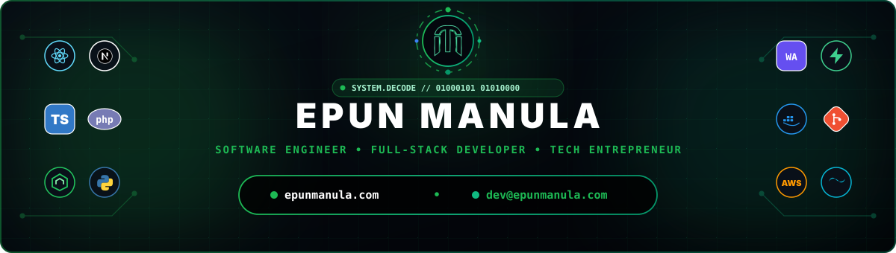

  

 

  
  
  

---

### 👨‍💻 About Me & Engineering Philosophy

Welcome to my digital workspace! I'm **Epun Manula**, a Computer Science Undergraduate, Full-Stack Software Engineer, and Tech Entrepreneur from Sri Lanka. I specialize in building high-performance web systems, cloud architectures, browser automation extensions, and client-side WebAssembly AI utilities.

- 🌐 **Official Website & Portfolio:** **[epunmanula.com](https://epunmanula.com)**
- 🔗 **Bio & Social Links Hub:** **[epunmanula.com/bio](https://epunmanula.com/bio)**
- ✉️ **Direct Email:** **[dev@epunmanula.com](mailto:dev@epunmanula.com)**
- 🎓 **Education & Focus:** Computer Science undergraduate specializing in full-stack architecture, clean backend APIs, and human-centered UI design.
- 🔭 **Featured Solutions & Works:**
  - 🎮 [**Havoc Gaming Platform**](https://epunmanula.com/projects) — Next.js, TypeScript, & Supabase real-time esports ecosystem.
  - 🧩 [**EMME Tabs**](https://epunmanula.com/projects) — Glassmorphism Chrome new-tab dashboard with custom canvas visualizers.
  - 🛡️ [**PrivacyBlur AI**](https://epunmanula.com/projects) — Privacy-first browser tool blurring faces locally via WebAssembly BlazeFace AI.
  - 📊 [**MHabit Tracker**](https://epunmanula.com/projects) — Unified habit & focus ecosystem (Web, Electron Desktop, & Android WebView).
  - 🎧 [**EMME Audio EQ Extension**](https://epunmanula.com/projects) — 10-Band Chrome audio equalizer & 3D spatial enhancer using Manifest V3 Offscreen DSP.
  - ⚡ [**EmmE Video Speed Master**](https://emmevideospeedmaster.page.gd/) — Granular HTML5 playback speed control with global hotkeys.
- 🎵 **Creative Work:** Independent Music Producer streaming across [Spotify](https://open.spotify.com/artist/2a5KgbDfSYmIWh6MpQB9ev), Apple Music, & SoundCloud.
- ⚡ **Fun Fact:** I love bridging complex backend logic with smooth micro-animations and custom audio DSP algorithms!

---

### 🟢 ⬛ ⚪ GitHub Signature Analytics (Custom Green • Black • White)

  

 

  

 

  
  
  

---

### 🛠️ Tech Stack & Engineering Toolkit

 

<table align="center" border="0" cellpadding="15" cellspacing="0" width="100%">
  <tr>
    <td align="center" valign="top" width="50%">
      <h4>💻 Frontend & Web Systems</h4>
      
      
      
      
      
      
      
    </td>
    <td align="center" valign="top" width="50%">
      <h4>⚙️ Backend & Architecture</h4>
      
      
      
      
      
    </td>
  </tr>
  <tr>
    <td align="center" valign="top" width="50%">
      <h4>🗄️ Databases, Cloud & DevOps</h4>
      
      
      
      
      
      
      
    </td>
    <td align="center" valign="top" width="50%">
      <h4>🎨 Creative Tools & Audio Workstations</h4>
      
      
      
      
      
    </td>
  </tr>
</table>

---

### 🐍 GitHub Contribution Matrix

  

---

### 📫 Connect & Collaborate

  

 

  
  
  
  
  
  
  

 

