  <picture>
    <source media="(prefers-color-scheme: dark)" srcset="dark.svg" />
    <source media="(prefers-color-scheme: light)" srcset="light.svg" />
    
  </picture>

 

  

  

---

### 👨‍💻 About Me & My Work

Welcome to my digital workspace! I'm a passionate Software Developer from Sri Lanka, specializing in modern web applications, browser automation utilities, and full-stack solutions.

- 🌍 **Portfolio & Website:** [epunmanula.rf.gd](https://epunmanula.rf.gd/portfolio)
- 🔭 **Currently Building & Scaling:**
  - 📚 [**TechSet**](https://techseteka.gt.tc/) — LMS and resource dashboard built for G.C.E A/L Technology students.
  - 🎟️ [**UMSLTickets**](https://umsltickets.online/) — Custom online ticketing platform with secure payment gateway integration.
  - ⚡ [**EmmE Video Speed Master**](https://emmevideospeedmaster.page.gd/) — Feature-rich Chrome extension for HTML5 video playback control.
- 🌱 **Constantly Exploring:** React, Next.js, Node.js, PHP, and Web Automation.
- ⚡ **Fun Fact:** I love optimizing workflows and building custom tools that automate repetitive tasks.

---

### 🛠️ Tech Stack & Tools

 

<table align="center" border="0" cellpadding="15" cellspacing="0">
  <tr>
    <td align="center" valign="top" width="50%">
      <h4>💻 Frontend &amp; Frameworks</h4>
      
      
      
      
      
      
      
    </td>
    <td align="center" valign="top" width="50%">
      <h4>⚙️ Backend &amp; Frameworks</h4>
      
      
      
      
      
    </td>
  </tr>
  <tr>
    <td align="center" valign="top" width="50%">
      <h4>🗄️ Databases, Cloud &amp; DevOps</h4>
      
      
      
      
      
      
    </td>
    <td align="center" valign="top" width="50%">
      <h4>🎨 Creative &amp; Tools</h4>
      
      
      
    </td>
  </tr>
</table>

---

### 🚀 Featured Projects & Extensions

* ⚡ [**EmmE Video Speed Master**](https://emmevideospeedmaster.page.gd/) — A powerful, lightweight Chrome extension offering absolute control over HTML5 video playback speeds with custom global hotkeys.
* 🎟️ [**UMSLTickets**](https://umsltickets.online/) — Custom online ticketing platform with secure payment gateway integration.
* 📚 [**TechSet**](https://techseteka.gt.tc/) — A dedicated LMS and resource dashboard built for G.C.E A/L Technology students.
* 🌐 [**EM Me Focus**](https://emmefocus.gt.tc/) — A custom web application project focused on productivity.
* 🔗 [**Link-in-Bio Hub**](https://epunmanula.rf.gd/bio.php) — My custom-built portfolio and central bio-link platform.

---

### 🐍 Contribution Activity

  

---

### 📫 Let's Connect & Work Together

  

 

  
  
  
  
  
  
  

 

  

